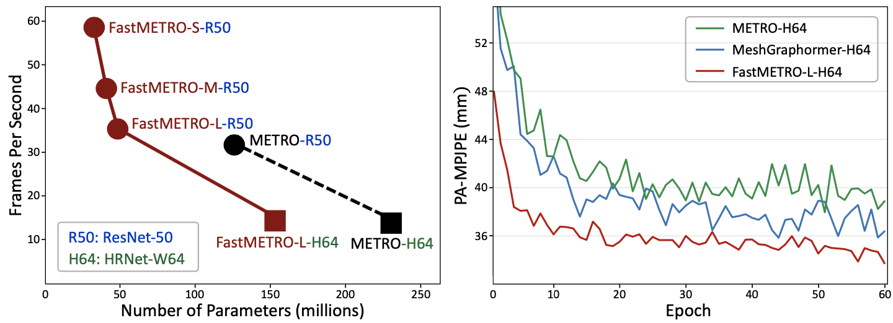

# [ECCV'22] FastMETRO
### [Paper](https://arxiv.org/abs/2207.13820) | [Project Page](https://fastmetro.github.io/) 

- This is the official PyTorch implementation of [Cross-Attention of Disentangled Modalities for 3D Human Mesh Recovery with Transformers](https://arxiv.org/abs/2207.13820) (ECCV 2022).
- **FastMETRO** (**Fast** **ME**sh **TR**ansf**O**rmer) has a novel transformer encoder-decoder architecture for 3D human pose and mesh reconstruction from a single RGB image.
- Compared with encoder-based transformers, FastMETRO-S is about **10× smaller and 2.5× faster** and FastMETRO-L is about **4× smaller and 1.2× faster** in terms of transformer architectures.


Our code is under refactoring. In the meantime, please refer to [[Code Snippet (Overall Architecture)]](./src/fastmetro.py) and [[Code Snippet (Transformer Encoder-Decoder)]](./src/transformer.py) which contains the main framework of our FastMETRO.

---

## Overview
Transformer encoder architectures have recently achieved state-of-the-art results on monocular 3D human mesh reconstruction, but they require a substantial number of parameters and expensive computations. Due to the large memory overhead and slow inference speed, it is difficult to deploy such models for practical use. In this paper, we propose a novel transformer encoder-decoder architecture for 3D human mesh reconstruction from a single image, called *FastMETRO*. We identify the performance bottleneck in the encoder-based transformers is caused by the token design which introduces high complexity interactions among input tokens. We disentangle the interactions via an encoder-decoder architecture, which allows our model to demand much fewer parameters and shorter inference time. In addition, we impose the prior knowledge of human body's morphological relationship via attention masking and mesh upsampling operations, which leads to faster convergence with higher accuracy. Our FastMETRO improves the Pareto-front of accuracy and efficiency, and clearly outperforms image-based methods on Human3.6M and 3DPW. Furthermore, we validate its generalizability on FreiHAND.


## Results
This repository provides several experimental results:





## Acknowledgments
This work was supported by Institute of Information & communications Technology Planning & Evaluation (IITP) grant funded by the Korea government (MSIT) (No. 2022-0-00290, Visual Intelligence for Space-Time Understanding and Generation based on Multi-layered Visual Common Sense; and No. 2019-0-01906, Artificial Intelligence Graduate School Program (POSTECH)).

Our repository is modified and adapted from these amazing repositories. If you find their work useful for your research, please also consider citing them:
- [METRO](https://github.com/microsoft/MeshTransformer)          
- [MeshGraphormer](https://github.com/microsoft/MeshGraphormer)
- [GraphCMR](https://github.com/nkolot/GraphCMR)
- [I2L-MeshNet](https://github.com/mks0601/I2L-MeshNet_RELEASE)
- [HMR](https://github.com/akanazawa/hmr)
- [DETR](https://github.com/facebookresearch/detr)
- [CoFormer](https://github.com/jhcho99/CoFormer)
- [GSRTR](https://github.com/jhcho99/gsrtr)


## Contact
fastmetro.official@gmail.com


## Citation
If you find our work useful for your research, please consider citing our paper:

````BibTeX
@InProceedings{cho2022FastMETRO,
    title={Cross-Attention of Disentangled Modalities for 3D Human Mesh Recovery with Transformers},
    author={Junhyeong Cho and Kim Youwang and Tae-Hyun Oh},
    booktitle={European Conference on Computer Vision (ECCV)},
    year={2022}
}
````


## License
This research code is released under the MIT license. Please see [LICENSE](./LICENSE) for more information.


---
###### *This work was done @ POSTECH Algorithmic Machine Intelligence Lab*
