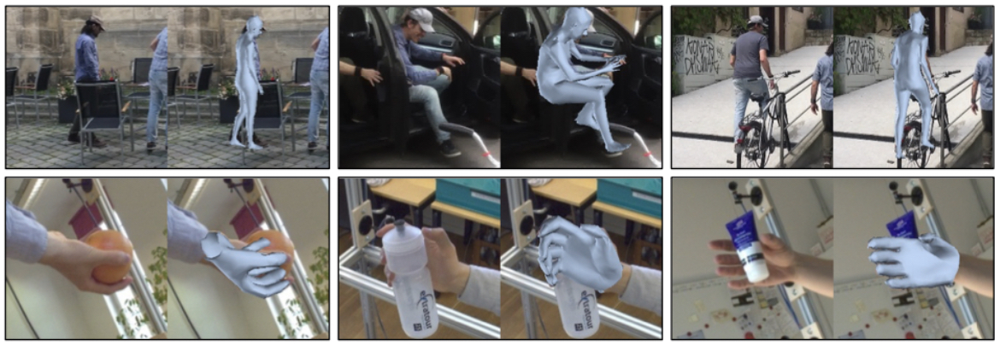
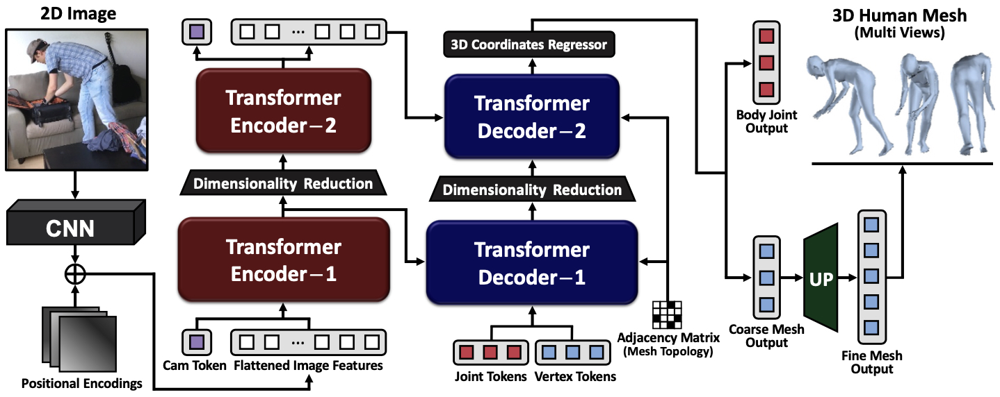
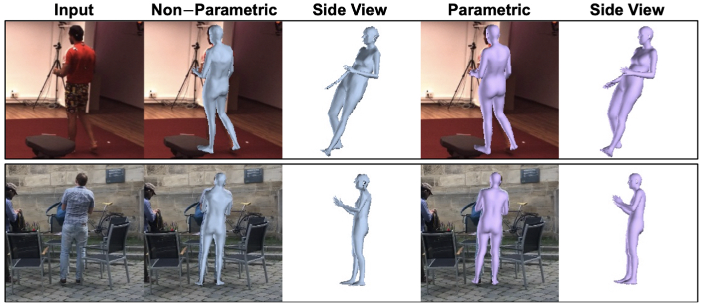

# [ECCV'22] Fast Mesh Transformer
### [Paper](https://arxiv.org/abs/2207.13820) | [Project Page](https://fastmetro.github.io/) | [Model Checkpoint](#model_checkpoint)

- This is the official PyTorch implementation of [Cross-Attention of Disentangled Modalities for 3D Human Mesh Recovery with Transformers](https://arxiv.org/abs/2207.13820) (ECCV 2022).
- **FastMETRO** (**Fast** **ME**sh **TR**ansf**O**rmer) has a novel transformer encoder-decoder architecture for 3D human pose and mesh reconstruction from a single RGB image. FastMETRO can also reconstruct other 3D objects such as 3D hand mesh.
- Compared with the encoder-based transformers ([METRO](https://github.com/microsoft/MeshTransformer) and [Mesh Graphormer](https://github.com/microsoft/MeshGraphormer)), FastMETRO-S is about **10× smaller and 2.5× faster** and FastMETRO-L is about **4× smaller and 1.2× faster** in terms of transformer architectures.




  

  

---

## Overview
Transformer encoder architectures have recently achieved state-of-the-art results on monocular 3D human mesh reconstruction, but they require a substantial number of parameters and expensive computations. Due to the large memory overhead and slow inference speed, it is difficult to deploy such models for practical use. In this paper, we propose a novel transformer encoder-decoder architecture for 3D human mesh reconstruction from a single image, called *FastMETRO*. We identify the performance bottleneck in the encoder-based transformers is caused by the token design which introduces high complexity interactions among input tokens. We disentangle the interactions via an encoder-decoder architecture, which allows our model to demand much fewer parameters and shorter inference time. In addition, we impose the prior knowledge of human body's morphological relationship via attention masking and mesh upsampling operations, which leads to faster convergence with higher accuracy. Our FastMETRO improves the Pareto-front of accuracy and efficiency, and clearly outperforms image-based methods on Human3.6M and 3DPW. Furthermore, we validate its generalizability on FreiHAND.



---

## Installation
We provide two ways to install conda environments depending on CUDA versions. 

Please check [Installation.md](./docs/Installation.md) for more information.

---

## Download
We provide guidelines to download pre-trained models and datasets. 

Please check [Download.md](./docs/Download.md) for more information.

<a name="model_checkpoint"></a>

### (Non-Parametric) FastMETRO
| Model                               | Dataset   | PA-MPJPE | Link            |
| ----------------------------------- | --------- | -------- | --------------- |
| FastMETRO-S-R50                     | Human3.6M | 38.8     | [Download](https://drive.google.com/u/2/uc?id=1v61B2ewify6zAedQHo8vXOhdzckKl3hT&export=download&confirm=t)        |
| FastMETRO-S-R50                     | 3DPW      | 49.1     | [Download](https://drive.google.com/u/2/uc?id=1tk5evwX8GHV1uckVQcmMB_Lhu_RZkf0I&export=download&confirm=t)        |
| FastMETRO-L-H64                     | Human3.6M | 33.6     | [Download](https://drive.google.com/u/2/uc?id=1WU6q27SV7YNGCSBLypB5IGFVWMnL26io&export=download&confirm=t)        |
| FastMETRO-L-H64                     | 3DPW      | 44.6     | [Download](https://drive.google.com/u/2/uc?id=19Nc-KyluAB4UmY70HoBvIRqwRFVy4jQB&export=download&confirm=t)        |
| FastMETRO-L-H64                     | FreiHAND  | 6.5      | [Download](https://drive.google.com/u/2/uc?id=1u6dr0E1w15IBmstcFaihr6r-DHKFWuw1&export=download&confirm=t)        |


### (Parametric) FastMETRO with an optional SMPL parameter regressor
| Model           | Dataset   | PA-MPJPE | Link            |
| --------------- | --------- | -------- | --------------- |
| FastMETRO-L-H64 | Human3.6M | 36.1     | [Download](https://drive.google.com/u/2/uc?id=1cx2siY3Ecjo8j036j9QCthf9agvYSDRK&export=download&confirm=t)        |
| FastMETRO-L-H64 | 3DPW      | 51.0     | [Download](https://drive.google.com/u/2/uc?id=16iSWbk9SQrlUDpWwD6pLknv2_4S5_XBS&export=download&confirm=t)        |

- Model checkpoints were obtained in [Conda Environment (CUDA 11.1)](./docs/Installation.md)
- To use SMPL parameter regressor, you need to set `--use_smpl_param_regressor` as `True`

---

## Demo
We provide guidelines to run end-to-end inference on test images.

Please check [Demo.md](./docs/Demo.md) for more information.

---

## Experiments
We provide guidelines to train and evaluate our model on Human3.6M, 3DPW and FreiHAND. 

Please check [Experiments.md](./docs/Experiments.md) for more information.

---

## Results
This repository provides several experimental results:




---

## Acknowledgments
This work was supported by Institute of Information & communications Technology Planning & Evaluation (IITP) grant funded by the Korea government (MSIT) (No. 2022-0-00290, Visual Intelligence for Space-Time Understanding and Generation based on Multi-layered Visual Common Sense; and No. 2019-0-01906, Artificial Intelligence Graduate School Program (POSTECH)).

Our repository is modified and adapted from these amazing repositories. If you find their work useful for your research, please also consider citing them:
- [METRO](https://github.com/microsoft/MeshTransformer)          
- [MeshGraphormer](https://github.com/microsoft/MeshGraphormer)
- [Pose2Mesh](https://github.com/hongsukchoi/Pose2Mesh_RELEASE)
- [I2L-MeshNet](https://github.com/mks0601/I2L-MeshNet_RELEASE)
- [GraphCMR](https://github.com/nkolot/GraphCMR)
- [HMR](https://github.com/akanazawa/hmr)
- [DETR](https://github.com/facebookresearch/detr)
- [CoFormer](https://github.com/jhcho99/CoFormer)

---

## License
This research code is released under the MIT license. Please see [LICENSE](./LICENSE) for more information.

SMPL and MANO models are subject to **Software Copyright License for non-commercial scientific research purposes**. Please see [SMPL-Model License](https://smpl.is.tue.mpg.de/modellicense.html) and [MANO License](https://mano.is.tue.mpg.de/license.html) for more information.

We use submodules from third party ([hassony2/manopth](https://github.com/hassony2/manopth)). Please see [NOTICE](./NOTICE.md) for more information.

---

## Contact
fastmetro.official@gmail.com

---

## Citation
If you find our work useful for your research, please consider citing our paper:

````BibTeX
@InProceedings{cho2022FastMETRO,
    title={Cross-Attention of Disentangled Modalities for 3D Human Mesh Recovery with Transformers},
    author={Junhyeong Cho and Kim Youwang and Tae-Hyun Oh},
    booktitle={European Conference on Computer Vision (ECCV)},
    year={2022}
}
````

---
###### *This work was done @ POSTECH Algorithmic Machine Intelligence Lab*
